 

<a href="https://www.linkedin.com/in/kaushik-santhosh-96059b326"><b>LinkedIn</b></a>
&nbsp;&nbsp;·&nbsp;&nbsp;
<a href="mailto:kaushiksanthosh169@gmail.com"><b>Email</b></a>
&nbsp;&nbsp;·&nbsp;&nbsp;
<a href="https://github.com/Kaushik-web-arch"><b>GitHub</b></a>

  

<h3><code>kaushik@github:~$ whoami</code></h3>

<table>
<tr>
<td valign="top" width="350">

</td>
<td valign="top" width="510">

</td>
</tr>
</table>

### `kaushik@github:~$ ls ./featured-projects`

<table>
<tr>
<td width="50%" valign="top">

#### [01 · AI Research Agent](https://github.com/Kaushik-web-arch/ai-research-agent)
Agentic research workspace that plans focused searches, gathers live web evidence, and produces structured source-backed reports with local caching.

`Agentic AI` · `Gemini API` · `Python`

</td>
<td width="50%" valign="top">

#### [02 · FinSight](https://github.com/Kaushik-web-arch/finsight-personal-finance-intelligence)
Personal-finance intelligence product spanning data ingestion, EDA, decision support, forecasting, risk classification, and anomaly detection.

`Machine Learning` · `Streamlit` · `Python`

</td>
</tr>
<tr>
<td width="50%" valign="top">

#### [03 · Student Placement Portal](https://github.com/Kaushik-web-arch/student-placement-porta)
Full-stack placement management system that keeps student records, placement drives, attendance, eligibility, and student access synchronized.

`Flask` · `MySQL` · `Python`

</td>
<td width="50%" valign="top">

#### [04 · AI Digital Twin](https://github.com/Kaushik-web-arch/ai-digital-twin)
Context-grounded personal AI assistant that uses professional profile information with Gemini to answer questions about my background and projects.

`LLMs` · `Gemini API` · `Python`

</td>
</tr>
</table>

<!-- PROJECTS_AUTO_START -->
### `kaushik@github:~$ ls ./all-projects`

This index is generated automatically from my public GitHub repositories that contain a README. Featured projects stay pinned above; newly published projects appear here automatically.

#### [Ai Research Agent](https://github.com/Kaushik-web-arch/ai-research-agent) · **Featured**
An agentic research workspace that converts a question into a structured, source backed Markdown report. The application plans focused searches, collects current web evidence, extracts…

`Public repository` · `Python` · [View repository](https://github.com/Kaushik-web-arch/ai-research-agent)

---

#### [Student Placement Porta](https://github.com/Kaushik-web-arch/student-placement-porta) · **Featured**
A full stack placement management application that keeps student records, placement drives, attendance, eligibility, and student access synchronized between dedicated administrator and…

`Public repository` · `Python` · [View repository](https://github.com/Kaushik-web-arch/student-placement-porta)

---

#### [Ai Digital Twin](https://github.com/Kaushik-web-arch/ai-digital-twin) · **Featured**
A personal AI assistant that acts as a conversational representation of my professional profile. It uses my résumé/profile context together with Google&#x27;s Gemini model to answer questions…

`Public repository` · `Python` · [View repository](https://github.com/Kaushik-web-arch/ai-digital-twin)

---

#### [Finsight Personal Finance Intelligence](https://github.com/Kaushik-web-arch/finsight-personal-finance-intelligence) · **Featured**
A recruiter ready personal finance product with an Executive Fintech interface and a complete data science pipeline. It goes beyond CRUD: data ingestion → feature engineering → EDA →…

`Public repository` · `Python` · [View repository](https://github.com/Kaushik-web-arch/finsight-personal-finance-intelligence)
<!-- PROJECTS_AUTO_END -->

### `kaushik@github:~$ cat ./in-progress/zen-sports.txt`

**Zen Sports & Fitness Management System** — a Streamlit system for student management, belt gradings, certificate templates, field mapping, and certificate issuance. The repository is currently private while the project is being tested.

`Streamlit` · `PostgreSQL` · `Supabase` · `Railway`

 

<h3><code>kaushik@github:~$ ./contributions.sh</code></h3>

  

<code>Building software at the intersection of AI, data, and practical applications.</code> 
<code>Currently exploring: Agentic AI · LLM systems · Full-stack development</code>

  

Profile art, contribution data, and the public project index refresh automatically with GitHub Actions.

